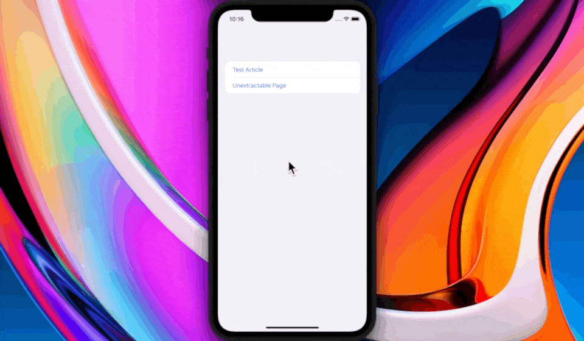

# Reeeed: the reader mode from [feeeed](https://feeeed.nateparrott.com/)



`Reeeed` is a Swift implementation of Reader Mode: you give it the URL to an article on the web, it extracts the content — without navigation, or any other junk — and shows it to you in a standard format. It's faster, more consistent and less distracting than loading a full webpage. You can pass `Reeeed` a URL, and get back simple HTML to display. Or you can present the all-inclusive SwiftUI `ReeeederView` that handles everything for you.


## Features

- `ReeeederView`: a simple SwiftUI Reader View that works on iOS and macOS. Just pass a URL and present it.
- `Reeeeder` extractor: pass a URL and receive cleaned HTML. You also get metadata, like the page's title, author and hero image.
- The generated HTML supports **custom themes**. Default _and_ custom themes support **dark mode** out of the box.

## Installation

1. In Xcode's menu, click File → Swift Packages → Add Package Dependency...
2. Paste the URL of this repository: `https://github.com/nate-parrott/reeeed`

Alternatively, add the dependency manually in your `Package.swift`: `.package(url: "https://github.com/nate-parrott/reeeed", from: "1.1.0")`

## Usage

**Simplest implementation: `ReeeederView`**

For the simplest integration, just present the batteries-included `ReeeederView`, like this:

```
import SwiftUI
import Reeeeder

struct MyView: View {
    var body: some View {
        NavigationLink("Read Article") {
            ReeeederView(url: URL(string: "https://www.nytimes.com/2022/09/08/magazine/book-bans-texas.html")!)
        }
    }
}

```

`ReeeederView` also supports a dictionary of additional options:


```
public struct ReeeederViewOptions {
    public var theme: ReaderTheme // Change the Reader Mode appearance
    public var onLinkClicked: ((URL) -> Void)?
}
```

**More flexible implementation**

You can use `Reeeeder` to fetch article HTML directly:

```
import Reeeeder
import WebKit
...
Task {
    do {
        let result = try await Reeeed.fetchAndExtractContent(fromURL: url, theme: options.theme)
        DispatchQueue.main.async {
            let webview = WKWebView()
            webview.load(loadHTMLString: result.styledHTML, baseURL: result.baseURL)
            // Show this webview onscreen
        }
    } catch {
        // We were unable to extract the content. You can show the normal URL in a webview instead :(
    }   
}
```

If you have more specific needs — maybe want to fetch the HTML yourself, or wrap the extracted article HTML fragment in your own template — here's how to do it. Customize the code as necessary:

```
Task {
    // Load the extractor (if necessary) concurrently while we fetch the HTML:
    DispatchQueue.main.async { Reeeed.warmup() }
    
    let (data, response) = try await URLSession.shared.data(from: url)
    guard let html = String(data: data, encoding: .utf8) else {
        throw ExtractionError.DataIsNotString
    }
    let baseURL = response.url ?? url
    // Extract the raw content:
    let content = try await Reeeed.extractArticleContent(url: baseURL, html: html)
    guard let extractedHTML = content.content else {
        throw ExtractionError.MissingExtractionData
    }
    // Extract the "Site Metadata" — title, hero image, etc
    let extractedMetadata = try? await SiteMetadata.extractMetadata(fromHTML: html, baseURL: baseURL)
    // Generated "styled html" you can show in a webview:
    let styledHTML = Reeeed.wrapHTMLInReaderStyling(html: extractedHTML, title: content.title ?? extractedMetadata?.title ?? "", baseURL: baseURL, author: content.author, heroImage: extractedMetadata?.heroImage, includeExitReaderButton: true, theme: theme)
    // OK, now display `styledHTML` in a webview.
}

```

## How does it work?

All the good libraries for extracting an article from a page, like [Mercury](https://github.com/postlight/parser) and [Readability](https://github.com/mozilla/readability), are written in Javascript. So `reeeed` opens a hidden webview, loads one of those parsers, and then uses it to process HTML. A page's full, messy HTML goes in, and — like magic — _just the content_ comes back out. You get consistent, simple HTML, and you get it fast.

Of course, these libraries aren't perfect. If you give them a page that is not an article — or an article that's just _too_ messy — you'll get nothing. In that case, `reeeed` will fall back to displaying the full webpage. 

## Things I'd like to improve

- [] The Mercury and Readability JS packages are a few months old. They need to be updated. Ideally, this would be (semi) automated.
- [] The API could use a bit of cleanup. The naming and code structure is a bit inconsistent.
- [] Reeeed depends on two different HTML manipulation libraries: [SwiftSoup](https://github.com/scinfu/SwiftSoup) and [Fuzi](https://github.com/cezheng/Fuzi). Fuzi is much faster, so I'd like to migrate the remaining `SwiftSoup` code to use it ASAP, and remove the dependency.
- [] Some day, I'd like to write a fully-native renderer for extracted content.
- [] Tests would be nice 😊
